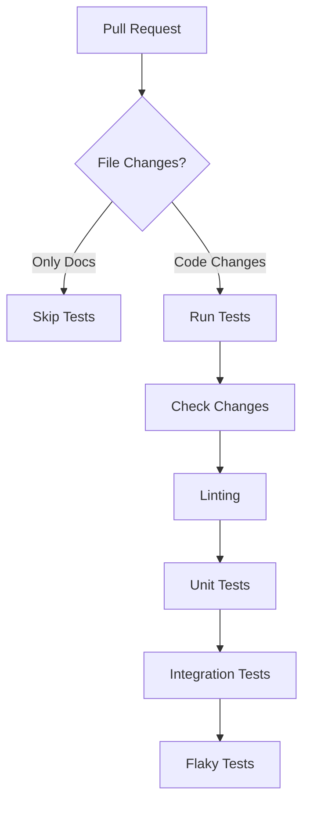

# Railway Deployment Checklist - Entity Extraction Fix

## ✅ Local Testing Results
- **Status:** All tests passed
- **Model Used:** `claude-3-5-haiku-20241022` (Haiku 3.5)
- **API Key:** Valid and has access to Haiku 3.5
- **Entity Extraction:** Working correctly

## 🚀 Railway Deployment Process

### Automatic Deployment via Git Integration

**Railway handles deployments automatically** when code is pushed to the main branch. No manual deployment steps are required.

#### How Railway Auto-Deployment Works:
1. **Git Integration**: Railway is connected to this repository's main branch
2. **Automatic Builds**: Railway automatically builds and deploys when changes are pushed to main
3. **Zero-Config**: Uses the existing `Procfile` for process definitions
4. **Environment Variables**: Railway dashboard manages all environment variables

#### Removed Redundant GitHub Actions Deployment
- **Previous Issue**: GitHub Actions had a redundant `railway-deploy` step causing authentication errors
- **Resolution**: Removed the deploy job from `.github/workflows/ci.yml`
- **Result**: Cleaner CI pipeline that focuses only on testing and code quality

### Optimized CI/CD Pipeline

The GitHub Actions workflow is now optimized for faster runs while maintaining quality:

#### **Performance Optimizations**
1. **Parallel Job Execution**: Tests run in parallel across multiple jobs
2. **Smart Caching**: Poetry dependencies cached based on lock file hash
3. **Conditional Execution**: Skip tests if only documentation changes
4. **Parallel Test Execution**: Uses `pytest-xdist` for parallel test execution within jobs
5. **Optimized Database Setup**: Faster MongoDB health checks and startup

#### **CI Pipeline Structure**


#### **Job Breakdown**
- **check-changes**: Early exit if only docs changed (paths-ignore filter)
- **lint**: Pre-commit hooks for code quality (black, isort, flake8)
- **unit-tests**: Fast unit tests with parallel execution (`-n auto`)
- **integration-tests**: Integration tests requiring external services
- **flaky-tests**: Non-blocking flaky/broken tests (continue-on-error)

#### **Test Strategy**
- **Stable Tests Only**: Only run tests marked as `stable` in CI
- **Parallel Execution**: `-n auto` uses all available CPU cores
- **Fail Fast**: `-x` stops on first failure in each job
- **Matrix Strategy**: Test across Python versions (currently 3.13)

#### **Expected Performance**
- **Target**: <3-5 minutes total CI runtime
- **Previous**: Sequential execution across 2 jobs
- **Current**: Parallel execution across 4+ jobs with smart caching

#### **Caching Strategy**
```yaml
key: ${{ runner.os }}-poetry-${{ matrix.job-type }}-${{ hashFiles('poetry.lock') }}
```
- Separate cache keys for different job types
- Includes pre-commit cache for linting
- Automatic cache invalidation when dependencies change

### Deployment Verification
Railway deployments are verified through:
1. **Railway Dashboard**: Monitor build logs and deployment status
2. **Railway CLI**: `railway logs` to view application logs
3. **Railway URL**: Test the deployed application at your Railway domain


**Success Pattern:**
```
INFO - Attempting entity extraction with Haiku 3.5 (claude-3-5-haiku-20241022)
INFO - Successfully extracted entities using Haiku 3.5
INFO - Batch metrics: articles_processed=10, entities_extracted=28
```

**Fallback Pattern (if 403 occurs):**
```
ERROR - Anthropic API request failed for Haiku 3.5: Status 403, Response: {...}
WARNING - 403 Forbidden for Haiku 3.5, trying fallback model...
INFO - Attempting entity extraction with Sonnet 3.5 (Fallback)
INFO - Successfully extracted entities using Sonnet 3.5 (Fallback)
```

### 4. Trigger Entity Extraction
Test the deployed service:

```bash
# Get your Railway URL
RAILWAY_URL="https://your-app.railway.app"

# Trigger enrichment
curl -X POST $RAILWAY_URL/api/v1/tasks/trigger-enrichment \
  -H "X-API-Key: your_api_key"
```

## 🔍 Troubleshooting

### If 403 Still Occurs on Railway

**Possible Causes:**
1. **Different API Key:** Railway might be using a different API key than local
2. **API Key Permissions:** The Railway API key might not have Haiku 3.5 access
3. **Environment Variable Not Set:** Check Railway dashboard for `ANTHROPIC_API_KEY`

**Verification Steps:**

1. **Check Railway Environment Variables:**
   ```bash
   railway variables
   ```

2. **Check Railway Logs for API Key:**
   Look for the masked key in logs:
   ```
   ✓ ANTHROPIC_API_KEY is set: sk-ant-...xyz
   ```

3. **Compare API Keys:**
   - Local: Check your `.env` file
   - Railway: Check Railway dashboard
   - Ensure they're the same key

4. **Test API Key Directly:**
   ```bash
   # Test with Railway's API key
   curl https://api.anthropic.com/v1/messages \
     -H "x-api-key: $RAILWAY_API_KEY" \
     -H "anthropic-version: 2023-06-01" \
     -H "content-type: application/json" \
     -d '{
       "model": "claude-3-5-haiku-20241022",
       "max_tokens": 100,
       "messages": [{"role": "user", "content": "Hello"}]
     }'
   ```

### If Fallback is Always Used

If logs show fallback is consistently used:
1. Update `ANTHROPIC_ENTITY_MODEL` to use Sonnet directly
2. Update cost settings to reflect Sonnet pricing:
   ```
   ANTHROPIC_ENTITY_INPUT_COST_PER_1K_TOKENS=0.003
   ANTHROPIC_ENTITY_OUTPUT_COST_PER_1K_TOKENS=0.015
   ```

## 📊 Cost Monitoring

**Haiku 3.5 (Preferred):**
- Input: $0.0008/1K tokens
- Output: $0.004/1K tokens
- Example batch (10 articles): ~$0.002-0.005

**Sonnet 3.5 (Fallback):**
- Input: $0.003/1K tokens (3.75x more)
- Output: $0.015/1K tokens (3.75x more)
- Example batch (10 articles): ~$0.008-0.020

## 📝 Changes Made

### Code Changes
1. **`.github/workflows/ci.yml`**
   - Removed redundant Railway deployment job
   - Streamlined CI pipeline to focus only on testing and code quality
   - Eliminated authentication issues with Railway deployment

2. **`src/crypto_news_aggregator/llm/anthropic.py`**
   - Added logging and enhanced error handling
   - Implemented model fallback logic
   - Added detailed 403 error logging

3. **`src/crypto_news_aggregator/core/config.py`**
   - Fixed model name: `claude-3-5-haiku-20241022`
   - Added fallback model config

### New Files
1. **`test_entity_extraction_debug.py`** - Debug test script
2. **`docs/ENTITY_EXTRACTION_403_FIX.md`** - Detailed fix documentation
3. **`RAILWAY_DEPLOYMENT_CHECKLIST.md`** - This file (updated for auto-deployment)

## ✅ Pre-Deployment Checklist

- [x] Local tests pass
- [x] Enhanced error logging added
- [x] Fallback logic implemented
- [x] Configuration updated
- [x] Railway environment variables verified
- [x] Changes committed to git
- [x] **Railway auto-deployment** will handle deployment automatically on push to main
- [ ] Railway logs monitored
- [ ] Entity extraction tested on Railway

## 🎯 Success Criteria

Deployment is successful when:
1. Entity extraction completes without errors
2. Logs show successful model usage (Haiku or Sonnet)
3. Entities are extracted and stored in database
4. No 403 errors in Railway logs (or fallback works correctly)
